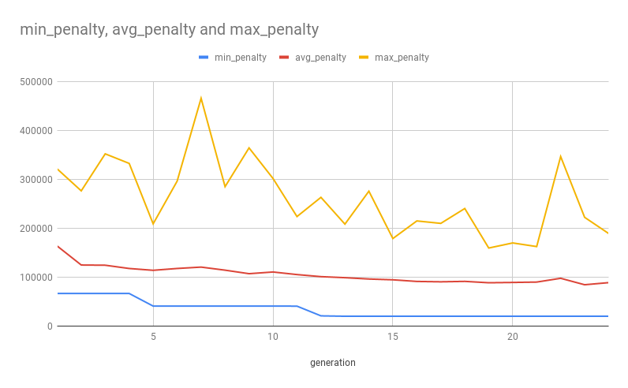

# Mars Lander 

## Author
- Wojciech Fica
- Codingame id: `voytekf`
- Best result on 
  - episode-2: score: 100%, fuel left: 1698, rank: 1711,
  - episode-3: score: 100%.

## Summary 
This is a report on an evolutionary-based controller for a [Mars Lander](https://www.codingame.com/ide/puzzle/mars-lander) optimization puzzle. The implemented model passes both episode-2 and episode-3, tests and validators. See enclosed screenshots. 

## Simulator 
I implemented a forward model that allows to simulate the course of the game for the given map, initial position, and a sequence of actions. In the first round of the *Easy on the right* test case it can do around **86500 random simulations**.

## RHEA
The model is based on *Rolling Horizon Evolutionary Algorithm (RHEA)* that implements the following methods.

### Model
The population consists of **100 chromosomes**, each chromosome has **DNA of length 230**, each gene encodes two numbers: `thrust_delta` and `rotation_delta`. A chromosome, given an initial state, represents a sequence of 230 moves. `m_i = (thrust_i, rotation_i)` where
- `thrust_i = thrust_{i-1} + thrust_delta_i`,
- `rotation_i = rotation_{i-1} + rotation_delta_i`.

I encode deltas instead of explicit moves as with the latter approach random initialization of genes results in many invalid chromosomes. 

### Initialization
I initialize 
- `rotation_delta` with a random integer from range [-15, ..., 15].
- `thrust_delta` with a const 1. 

In the initial approach I used to initialize `thrust_delta` with a random number in range [-1, 0, 1]. This produced worse results (couldn't pass episode-2). Intuition behind this fact could be that a thrust of 4 is almost always needed to compensate for Mars gravity. So it does not hurt to use max power during the first few rounds, for the later rounds the algorithm will have enough times to evolve and adapt. *Note:* This should have had no effect if the algorithm had had more time to explore all the possible paths.   


### Replacement
Simple replacement: the number of chromosomes stays the same in each generation.

All chromosomes (parents) are sorted by their fitness score before a new generation is produced. Top 12 parents are kept in the new generation (**Elitism = 12%**). The remaining 88 chromosomes are produced by the standard procedure:
- selecting two parents,
- producing two children by a `Crossover` method,
- mutating each child with a `Mutation` method.


### Selection
The better the fitness score of an individual the more often should it be selected as a parent. To accomplish that the selection could be proportionate to the scores. Instead, I chose to draw the individuals from `Beta(alpha =  1, beta = 3)` distribution as this also corresponds well with what we want to achieve here. *Note:* I initially started with `Beta(1, 5)` distribution but this   was not a good choice as the 25% of the worst chromosomes were almost never selected - see the Notes section.

### Crossover
Each gene is a convex combination of the parent's genes with a randomly chosen coefficient, i.e.
- `child_thrust_delta = parent_1_thrust_delta * rho + parent_2_thrust_delta * (1 - rho)`
- same for `rotation_delta`.


### Mutation
- Chromosome mutation: Each gene in a chromosome is mutated independently with a mutation chance of 4%. 
- Gene mutation: 
  - `rotation_delta` changes to a random integer from range [-15, ..., 15].
  - `thrust_delta` changes to a random number in range [-1, 0, 1].


### Fitness score
Fitness method is a penalty function: given an initial lander state and a chromosome it evaluates how good the chromosome performs on the given state. 

First, the moves encoded in the chromosome are performed on the state to simulate the lander path. Then, if the lander is still flying after the moves have been performed, additional random moves are performed until the lander lands or crashes. 

If the landing was successful then the penalty is 0. In case of a crash the penalty is calculated as a sum of a few factors:
- euclidean distance between the lander and the landing place,
- surplus of vertical and horizontal speed,
- squared rotation.

On top of that an additional penalty is added to *guide* the algorithm to split the optimisation process into stages:
- penalty of 120k in case the lander crashed outside of the map (this has to be added to pass episode-3),
- penalty of 100k or 80k in case the lander crashed ouside of the landing place. 100k in case the X coordinate didn't match, 80k in case the Y coordinate didn't match.
- penalty of 60k in case the lander finished in the right place but with excessive vertical speed.
- penalty of 40k in case  the lander finished in the right place but with excessive horizontal speed.
- penalty of 20k in case  the lander finished in the right place with the right speed but non-zero rotation.

The algorithm was able to pass all the test with this version of the penalty function. Here is how the penalty developed in time on the *Easy on the right* test case. The algorithm needed 25 generations to find a chromosome with 0 penalty. 




Now, I provide an example of a penalty function that did not work. It was of a form
```
penalty := distance between the lander and the landing place
if (penalty < 100 )
   penalty += squared rotation
if (penalty < 50)
    penalty += surplus of vertical and horizontal speed
```
with no extra penalty added. This approach tried to combine the two stages of calculating the penalty mentioned before. It did not work. The minimal achieved penalty was never smaller than 50. The reason for that was that 50 was a local minimum - adding a surplus of vertical and horizontal speed increased the penalty too much and hence the algorithm could not escape the local min. Contrary to the first approach where moving from one penalty stage to another always decreases the total penalty score.

### Notes on Beta(1, 3) vs Beta(1, 5)
Beta(1, 5) was not a good choice as the 25% of the worst chromosomes were almost never selected. Please compare the density functions:

**Beta(1, 3).** 

")

**Beta(1, 5).** 

")


